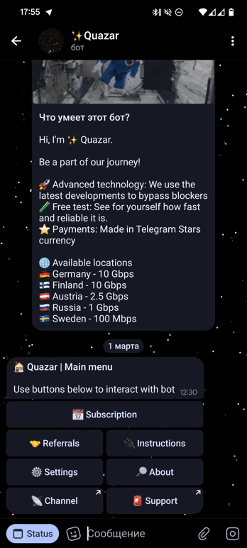
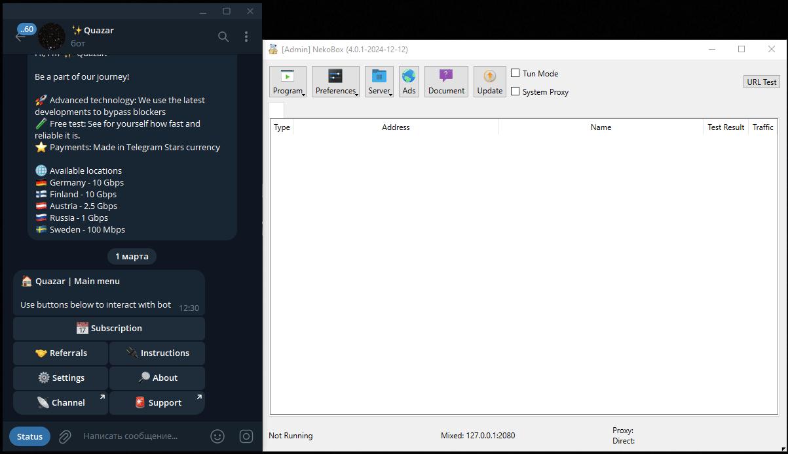

# How to add subscription

## Get personal link
To add a VPN to apps you first need to get your personalized link in the [Quazar](https://t.me/quazar_accessbot) - Subscription menu. Once you receive the link it needs to be added to your app, you'll find instructions below

## Activate Android (Happ)
1. Download [Happ from Google Play​](https://play.google.com/store/apps/details?id=com.happproxy)
2. Open Happ and follow video (click to zoom in)
{width=200px}

## Activate iOS (Happ)
1. Download [Happ from AppStore​](https://apps.apple.com/us/app/happ-proxy-utility/id6504287215)
2. Open Happ and follow video (click to zoom in)

## Activate Windows (NekoBox)
1. Download [Happ from AppStore​](https://apps.apple.com/us/app/happ-proxy-utility/id6504287215)
2. Open Happ and follow video (click to zoom in)
