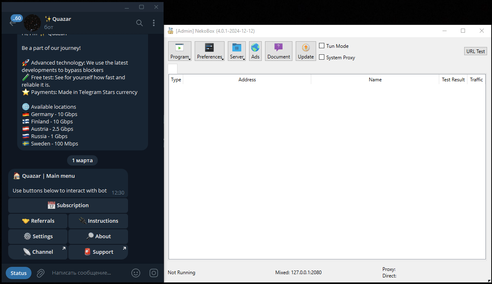

# Как добавить подписку

## Получите персонализированную ссылку
Чтобы добавить VPN в приложение, сначала получите свою персонализированную ссылку в [Quazar](https://t.me/quazar_accessbot) — меню "Подписка". После получения ссылки её нужно добавить в приложение. Инструкции ниже.

## Активация на Android (Happ)
1. Скачайте [Happ из Google Play](https://play.google.com/store/apps/details?id=com.happproxy).
2. Откройте Happ и следуйте видеоинструкции (нажмите для увеличения).  
   {width=200px}

## Активация на iOS (Happ)
1. Скачайте [Happ из AppStore](https://apps.apple.com/us/app/happ-proxy-utility/id6504287215).
2. Откройте Happ и следуйте видеоинструкции (нажмите для увеличения).

## Активация на Windows (NekoBox)
1. Скачайте [NekoBox для Windows](https://github.com/MatsuriDayo/NekoBoxForWindows/releases).
2. Откройте NekoBox и следуйте видеоинструкции (нажмите для увеличения).  
     
